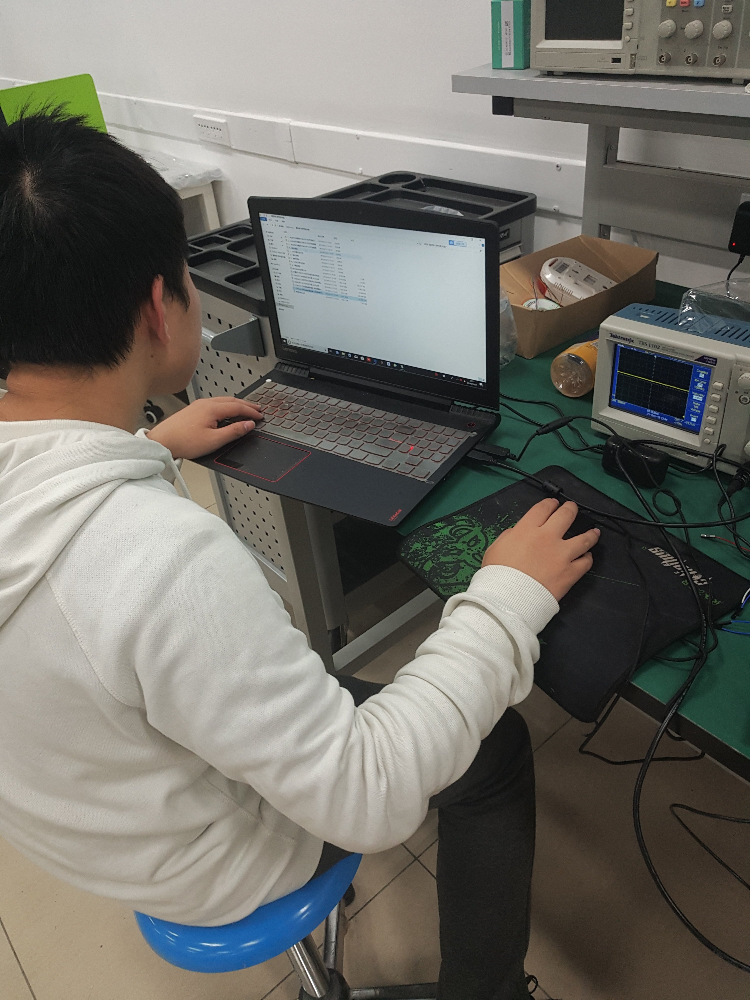
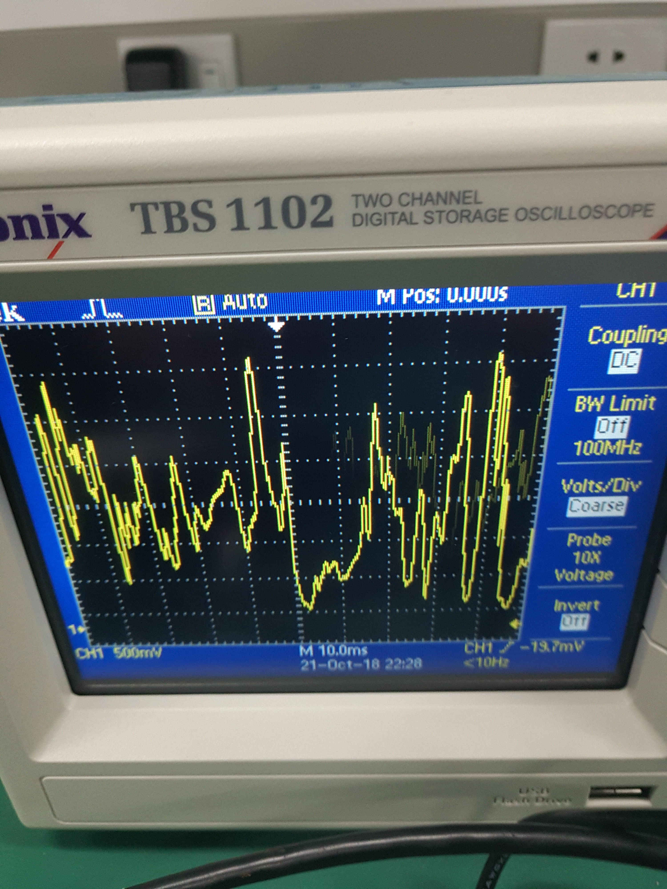

# Speech_synthesis
2018年10月，实验室老师分配的一个小项目
## 进度（2018.10.8）
使用语音模块，可以实现录音和播放的功能，接下来难点在于通讯代码的加入。

## 结果

代码已经写出，也进行了测试，语音可以正常录制，但接收时出现了问题

代码调试图：

连接实物图展示，主要使用通信模块和语音接收模块

这个是录制语音模块，用示波器显示录制效果的图片

**功能尚未完成，还待努力**